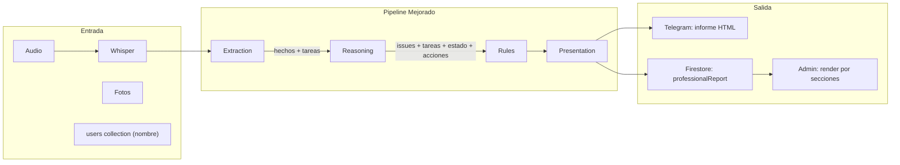

# Informes de Inspección Profesionales

## Contexto

El pipeline actual genera un resumen corto + lista plana de incidencias. El objetivo es producir informes profesionales tipo "VILLA AZUL" con: cabecera estructurada, tareas realizadas, incidencias agrupadas por ubicación con prioridad, acciones recomendadas consolidadas y estado final de la propiedad.

## Flujo de datos propuesto



---

## FASE 1 -- Mejorar prompts de Extraction y Reasoning

**Archivos:**

- [functions/agent/reportPipeline/prompts/extractionPrompt.js](functions/agent/reportPipeline/prompts/extractionPrompt.js)
- [functions/agent/reportPipeline/prompts/reasoningPrompt.js](functions/agent/reportPipeline/prompts/reasoningPrompt.js)

### Extraction -- añadir `tasksPerformed`

El prompt actual solo extrae `facts` (issues). Añadir un campo `tasksPerformed` para capturar lo que el trabajador dice haber revisado/realizado. El trabajador ya lo dice en el audio ("he revisado la limpieza del salón, comprobado las toallas...").

Nuevo schema de salida:

```json
{
  "propertyName": "Villa Azul",
  "location": "Calpe",
  "facts": [ ... ],
  "tasksPerformed": [
    "Revisión de limpieza general en salón, cocina y dormitorios",
    "Comprobación de ropa de cama y toallas",
    "Reposición de amenities en baños"
  ]
}
```

### Reasoning -- añadir campos profesionales

El prompt actual genera `issues`, `transcriptionSummary`, `mainContext`. Añadir:

- `tasksPerformed` -- pasar las tareas extraídas (refinadas/agrupadas por el LLM)
- `finalStatus` -- evaluación final: "Apta para entrada con observaciones pendientes de mantenimiento"
- `consolidatedActions` -- lista priorizada de acciones: ["Sustituir bombilla hoy", "Avisar a mantenimiento para revisar humedad"]
- `reportTitle` -- título del informe: "INFORME DE REVISIÓN - VILLA AZUL"

Nuevo schema de salida:

```json
{
  "mainContext": "...",
  "transcriptionSummary": "...",
  "reportTitle": "INFORME DE REVISIÓN - VILLA AZUL",
  "tasksPerformed": ["..."],
  "overallPriority": "medium",
  "requiresImmediateAction": false,
  "issues": [ ... ],
  "consolidatedActions": [
    "Sustituir bombilla hoy",
    "Avisar a mantenimiento para revisar humedad"
  ],
  "finalStatus": "Apta para entrada con observaciones pendientes de mantenimiento"
}
```

---

## FASE 2 -- Actualizar pipeline y modelo de datos

**Archivos:**

- [functions/agent/reportPipeline/runReportPipeline.js](functions/agent/reportPipeline/runReportPipeline.js) -- pasar `tasksPerformed` al reasoning
- [functions/agent/reportPipeline/presentation/dashboardReportMapper.js](functions/agent/reportPipeline/presentation/dashboardReportMapper.js) -- mapear nuevos campos
- [functions/agent/reportPipeline/domain.js](functions/agent/reportPipeline/domain.js) -- actualizar typedefs
- [functions/agent/telegramWebhook.js](functions/agent/telegramWebhook.js) -- obtener nombre del trabajador
- [functions/agent/createInspectionReport.js](functions/agent/createInspectionReport.js) -- persistir nuevos campos

### Cambios clave:

**1. `resolveUserByTelegramId`** (línea 84 de telegramWebhook.js): actualmente devuelve `{uid, role}`. Añadir `displayName` (o `name`/`firstName`) del documento del usuario para usarlo como "Responsable" en la cabecera del informe.

**2. `runReportPipeline`**: Pasar `tasksPerformed` del resultado de extraction al reasoning como input adicional.

**3. `toDashboardReport`**: Mapear los nuevos campos del assessment:

- `report_header`: `{ title, date, responsible, location }`
- `tasks_performed`: array de strings
- `consolidated_actions`: array de strings
- `final_status`: string
- `issues` agrupados por `location` (ya tienen el campo, solo falta agrupar en presentación)

**4. `createReportFromPipeline`**: Persistir en Firestore los nuevos campos:

- `reportHeader` (título, responsable, ubicación)
- `tasksPerformed`
- `consolidatedActions`
- `finalStatus`

---

## FASE 3 -- Presentación profesional en Telegram

**Archivo:** [functions/agent/telegramWebhook.js](functions/agent/telegramWebhook.js) (líneas 1268-1305)

Reemplazar el preview básico actual por un informe profesional en HTML de Telegram:

```
📋 INFORME DE REVISIÓN - VILLA AZUL
━━━━━━━━━━━━━━━━━━━━━━
📅 23/03/2026 10:15
👤 María López
📍 Calpe

📝 Resumen general
Se ha realizado la revisión completa...

✅ Tareas realizadas
• Revisión de limpieza general
• Comprobación de ropa de cama
• Reposición de amenities

⚠️ Incidencias detectadas (3)

🔸 Dormitorio principal
Bombilla no funciona en lámpara mesilla.
Prioridad: media

🔸 Baño planta superior
Marca de humedad cerca del lavabo.
Prioridad: alta

📸 Material gráfico: 3 fotos

🔧 Acciones recomendadas
1. Sustituir bombilla hoy
2. Avisar a mantenimiento para humedad

📊 Estado final
Apta para entrada con observaciones.
```

También enviar un segundo mensaje después de confirmar con el informe completo formateado (no solo el preview).

**Nota sobre límites**: Telegram tiene límite de 4096 caracteres por mensaje. Si el informe excede, truncar con indicación de ver detalle completo en el dashboard.

---

## FASE 4 -- Admin Dashboard - render completo

**Archivo:** [admin-dashboard/src/pages/ReportesPage.jsx](admin-dashboard/src/pages/ReportesPage.jsx) (componente `ReportDetailPanel`, líneas 37-452)

### Panel de detalle -- reemplazar por secciones profesionales:

Actualmente muestra: Propiedad, Fecha, Resumen (texto plano), Issues (lista plana), Fotos (grid).

Nuevo layout por secciones:

- **Cabecera**: Título del informe, fecha/hora, responsable, ubicación (campo `reportHeader`)
- **Resumen general**: Párrafo descriptivo mejorado (campo `summary`)
- **Tareas realizadas**: Lista con checks verdes (campo `tasksPerformed`)
- **Incidencias detectadas**: Agrupadas por ubicación, con badges de prioridad y categoría (usando `dashboardReport.issues` con `location`, `priority`, `category`, `recommended_action`)
- **Material gráfico**: Fotos con etiquetas si hay `photoIndices` vinculados
- **Acciones recomendadas**: Lista numerada priorizada (campo `consolidatedActions`)
- **Estado final**: Badge con el veredicto (campo `finalStatus`)

### Cards de la lista -- mejorar:

- Mostrar badge de prioridad global
- Mostrar estado final como subtítulo

### Retrocompatibilidad:

Los informes existentes en Firestore no tendrán los nuevos campos. Todos los campos nuevos deben ser opcionales con fallback al formato actual.

---

## Resumen de archivos a modificar

- `functions/agent/reportPipeline/prompts/extractionPrompt.js` -- Añadir `tasksPerformed` al schema
- `functions/agent/reportPipeline/prompts/reasoningPrompt.js` -- Añadir `tasksPerformed`, `consolidatedActions`, `finalStatus`, `reportTitle`
- `functions/agent/reportPipeline/runReportPipeline.js` -- Pasar `tasksPerformed` de extraction a reasoning
- `functions/agent/reportPipeline/presentation/dashboardReportMapper.js` -- Mapear nuevos campos al DashboardReport
- `functions/agent/reportPipeline/domain.js` -- Actualizar typedefs
- `functions/agent/telegramWebhook.js` -- Obtener nombre usuario + nuevo formato de preview/informe
- `functions/agent/createInspectionReport.js` -- Persistir nuevos campos en Firestore
- `admin-dashboard/src/pages/ReportesPage.jsx` -- Render profesional por secciones

## Riesgos y notas

- **Retrocompatibilidad**: Informes existentes no tendrán nuevos campos. Admin dashboard debe manejar ambos formatos (campos opcionales con fallback).
- **Coste OpenAI**: No hay llamadas adicionales. Los mismos 2 calls (extraction + reasoning) generan más contenido.
- **Fotos vinculadas**: No se implementa vinculación automática foto-incidencia (requeriría GPT-4o Vision). Se mantiene la vinculación manual desde el admin.
- **Longitud Telegram**: Límite de 4096 chars por mensaje. Se truncará con enlace al dashboard si excede.
